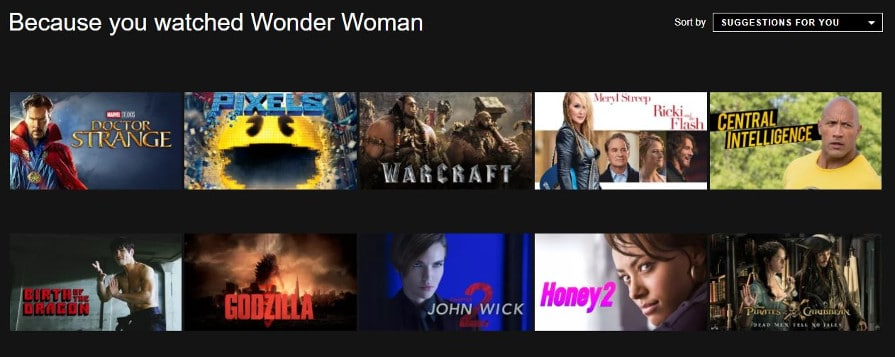

# Introduction to movie_recommendation_P4
Use machine learning packages in python to create two movie recommendation systems (one content based and one collaborative based)

### About Recommendation Systems
First of all what is a recommendation system? A recommendation system is software that analyzes data so that it can make predictions for things that a user might enjoy. 
Today recommendation systems are in everything we do, a few quick examples of companies with recommendation systems are Amazon, Youtube, Netflix, and even Tinder. Here is a screenshots of Netflix's recommendation systems:

### Types of Recommendation Systems
There are four types of recommendation systems

1. **Content Based** – system takes attributes of product/s that the user likes and suggests other products with similar attributes
  * For Example: If I go onto Amazon and buy a hammer. Amazon might suggest that I buy other hammers, screws, or wrenches because they are all tools
2. **Collaborative Based** - within collaborative based systems there are actually multiple recommendation systems: item-item based filtering and user-item based filtering
  * **Item-item based filtering** - looks at items users have already purchased / used in the past and recommends similar items.
    * Similar items - in this model are measured by how similarly they are rated by users
    * Item-item based filtering was invented by Amazon and it is still used by Amazon today
    * Item-item based filtering is less resource intensive than user-user based filtering and easier to implement for new users
  * **User-item based filtering** - groups users together based on whether or not they share similar habits and recommends products to users that other users in their group have enjoyed
    * Very effective algorithm but very time and resource intensive 
3. **Popularity Based** - recommends the most popular products
4. **Hybrid Model** - combination of two or more of the systems above

* In this repo I will create 2 models, one will be content based and one will be collaborative based. Popularity Based and Hybrid Models are both effective models but they just are not used in this repo

# System Requirements

There are only 2 coding softwares used in this repo: **Python version 3** and **Microsoft Excel**

Additionally, there libraries within Python that you will want to have installed before jumping here

### Python Libraries
* Pandas
* Matplotlib
* Numpy
* Sklearn
  * From .metrics.feature_extraction.text import CountVectorizer
  * From .metrics.pairwise import cosine_similarity
  * From .feature_extraction.text import TfidfVectorizer
  * From .neighbors import KNeighborsClassifier
  * From .metrics.pairwise import linear_kernel

# Data Sources
In this repo I used two links to gather data. 

1. The first link used in this repo is https://www.kaggle.com/tmdb/tmdb-movie-metadata
  * From this link download both csv files, tmdb_5000_credits.csv and tmdb_5000_movies.csv, these csv files are used in 01_Content_Based_Filtering_System
    * I saved both these csv files to 01_Content_Based_Filtering_System/01_Starting_Datasets
    * Both of these csv files are read into Cleaning Data.ipynb cleaned up, merged together, and the movies.csv file in 01_Content_Based_Filtering_System/01_Starting_Datasets is just the cleaned up version of these files. 

2. The second link used in this repo is https://grouplens.org/datasets/movielens/latest/
  * From this link download ml-latest.zip 
    * Within this zip folder there are multiple csv files the only 2 used in this repo are movies.csv and ratings.csv
    * Both these csv files are used in Movie_Recommender.ipynb

# Data Analysis 
### Content Based

### Collaborative Based

# Conclusions
### Content Based

### Collaborative Based

# Citations
**Data Sources**
https://www.kaggle.com/tmdb/tmdb-movie-metadata
https://grouplens.org/datasets/movielens/latest/

**Other Links Used**
https://github.com/codeheroku/Introduction-to-Machine-Learning/blob/master/Building%20a%20Movie%20Recommendation%20Engine/Movie_Recommendation_Engine.ipynb

https://github.com/KevinLiao159/MyDataSciencePortfolio/blob/master/movie_recommender/movie_recommendation_using_KNN.ipynb

https://medium.com/@cmukesh8688/tf-idf-vectorizer-scikit-learn-dbc0244a911a

